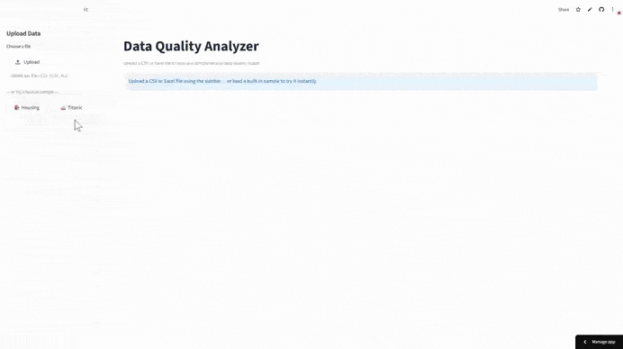
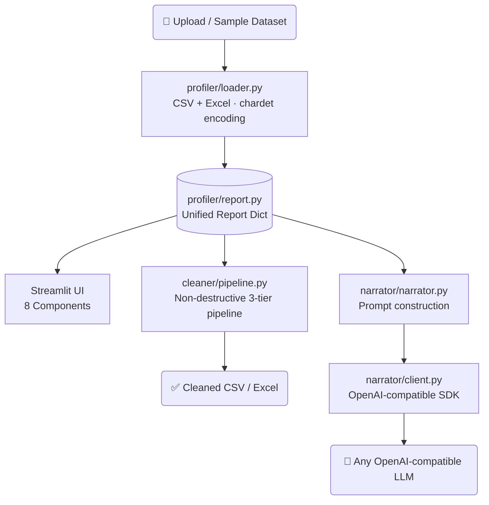

# Data Quality Analyzer

[](https://llm-data-quality-analyzer.streamlit.app/)

<p align="center">
  
  
  
  
  
  
  
  
  
</p>

A Streamlit app for automated data profiling, interactive cleaning, and optional LLM-powered quality insights — upload a CSV or Excel file and instantly get a comprehensive report with actionable recommendations.

---

## Table of Contents

- [Demo](#demo)
- [Features](#features)
- [Architecture](#architecture)
- [How It Works](#how-it-works)
- [Quick Start](#quick-start)
- [Development](#development)
- [Project Structure](#project-structure)
- [Sample Datasets](#sample-datasets)
- [Tech Stack](#tech-stack)
- [Configuration](#configuration)
- [Possible Future Improvements](#possible-future-improvements)
- [License](#license)
- [Author](#author)

---

## Demo



The demo walks through the full pipeline end-to-end:

1. **Load a sample dataset** from the sidebar — no upload required.
2. **Explore the profiling report** — overview stats, per-column analysis, missing value patterns, outlier detection, correlation heatmap, and actionable recommendations.
3. **Apply cleaning actions** — select strategies for missing values, duplicates, type mismatches, and outliers, then click **Apply Cleaning**.
4. **Review the Before vs. After** comparison and download the cleaned dataset as CSV or Excel.
5. **Enable AI Insights** — toggle the LLM panel to generate a plain-English dataset overview and cleaning plan, then ask follow-up questions.

---

## Features

- ✅ **Data Profiling** — per-column statistics, type inference, missing value analysis with MCAR/MAR/MNAR classification, outlier detection (IQR & Z-score), normality tests, correlation heatmap
- ✅ **Quality Score** — composite 0–100 score and letter grade (A–F) computed from missing rate, duplicates, type mismatches, and outlier prevalence
- ✅ **Interactive Cleaning** — remove duplicates, impute missing values (mean/median/mode/constant/ffill/bfill), fix type mismatches, handle outliers; every step logged, nothing mutated
- ✅ **LLM Insights (optional)** — plain-English explanations and a free-form Q&A interface, powered by any OpenAI-compatible API; summary stats only — raw data never leaves your machine
- ✅ **Export** — download the cleaned dataset as CSV or Excel
- ✅ **Built-in Samples** — two ready-to-explore datasets (Housing, Titanic) with realistic data quality issues; no upload required

---

## Architecture



**Data flow:**

1. **Profiling path** — File → Loader (CSV/Excel · chardet encoding) → Report dict (profiler sub-modules) → Streamlit UI
2. **Cleaning path** — Report dict + user selections → Cleaning pipeline (non-destructive, 3-tier) → Cleaned DataFrame → Download
3. **Insights path** — Report dict summary stats → Narrator → LLM API → Plain-English insights (raw data never transmitted)

---

## How It Works

### 1. File Loading
CSV files use `chardet` for encoding detection and auto-detect the separator (`,` vs `;`). Excel files support multi-sheet selection. Files up to 200 MB are accepted.

### 2. Type Inference
Each column is inspected beyond its pandas dtype: numeric strings, boolean-like text (`yes`/`no`/`true`/`false`), mixed types, and datetime patterns are detected and a `type_mismatch` flag is set when pandas and inferred types disagree.

### 3. Statistics & Distributions
Numeric columns receive mean, median, standard deviation, min, and max. Categorical columns receive unique count and top value. Distribution analysis runs normality tests (Shapiro–Wilk for small columns, Kolmogorov–Smirnov for larger ones), plus skewness and kurtosis labelling.

### 4. Missing Values
Missing count, percentage, and a heuristic pattern classification:
- **MCAR** — missingness appears random
- **MAR** — strongly overlaps with another missing column
- **MNAR** — structural (>60% absent)

### 5. Outlier Detection
Both IQR (1.5× multiplier) and Z-score (±3σ) methods return counts, percentages, and the exact row indices — so the cleaning pipeline can target them precisely without index drift.

### 6. Quality Score
Points are deducted for: missing cell rate, duplicate row rate, per-column type mismatches, and outlier prevalence. Clean columns add small bonuses. Final score maps to A–F grades using configurable thresholds in `config/settings.py`.

### 7. Cleaning Pipeline
Non-destructive three-tier pipeline:
1. **Tier 0** — type fixes and fill operations (no row count change)
2. **Tier 1** — outlier removal (uses profiler-computed indices; must run before row drops)
3. **Tier 2** — row-dropping operations (drop_rows, drop_column, remove_duplicates)

Every step is logged (action, column, rows before/after). The original DataFrame is never mutated.

### 8. LLM Insights
Only summary statistics from the report dict are sent to the API — raw data rows are never transmitted. Insights are cached in session state after first generation. All LLM calls are user-triggered.

---

## Quick Start

### 1. Clone and install

```bash
git clone https://github.com/farmand-bt/llm-data-quality-analyzer.git
cd llm-data-quality-analyzer
uv sync
```

Or with pip:

```bash
pip install -r requirements.txt
```

### 2. Run

```bash
uv run streamlit run app/app.py
# or
make run
```

Open [http://localhost:8501](http://localhost:8501). Upload a CSV / Excel file — or click one of the built-in sample buttons to explore immediately.

### 3. (Optional) Enable LLM Insights

Copy the example env file and fill in your credentials:

```bash
cp .env.example .env
```

```env
GWDG_API_KEY=your_key_here
GWDG_API_BASE=https://your-api-endpoint
GWDG_MODEL_NAME=llama-3.3-70b-instruct
```

Any OpenAI-compatible provider works (GWDG, Together AI, Groq, local Ollama with OpenAI-compat layer, etc.). Restart the app, then toggle **🤖 Enable AI Insights** in the sidebar.

---

## Development

```bash
make install   # uv sync
make run       # uv run streamlit run app/app.py
make lint      # ruff check --fix + ruff format
make test      # pytest tests/
make clean     # remove __pycache__ and .pytest_cache
```

---

## Project Structure

```
llm-data-quality-analyzer/
├── app/
│   ├── app.py                  # Streamlit entry point
│   └── components/             # UI: overview, column_report, outliers,
│                               #   duplicates, correlations, recommendations,
│                               #   cleaning_panel, llm_insights
├── profiler/                   # Analysis engine
│   ├── loader.py               # CSV / Excel parsing
│   ├── type_detector.py        # Inferred-type logic
│   ├── stats.py                # Descriptive statistics
│   ├── missing.py              # Missing-value analysis + MCAR/MAR/MNAR
│   ├── outliers.py             # IQR and Z-score detection
│   ├── duplicates.py           # Exact and near-duplicate detection
│   ├── distributions.py        # Normality tests, skew, kurtosis
│   ├── correlations.py         # Pearson + Cramér's V
│   ├── recommendations.py      # Rule-based severity recommendations
│   └── report.py               # Aggregates all sub-modules into one dict
├── cleaner/                    # Cleaning engine
│   ├── missing_handler.py
│   ├── duplicate_handler.py
│   ├── type_fixer.py
│   ├── outlier_handler.py
│   └── pipeline.py             # Orchestrates steps in priority order
├── narrator/                   # LLM integration
│   ├── client.py               # API calls with retry/backoff
│   ├── prompts.py              # Prompt builders
│   └── narrator.py             # High-level narration methods
├── config/
│   └── settings.py             # All thresholds and constants
├── tests/                      # pytest suite (200+ tests)
├── scripts/
│   └── generate_messy_data.py  # Synthetic dataset generator
├── sample_data/
│   ├── housing_messy.csv       # 520 rows — price, sqft, outliers, mixed types
│   └── titanic_messy.csv       # 911 rows — missing age/cabin, inconsistent labels
├── assets/                     # Demo GIF and architecture diagram
├── .streamlit/
│   └── config.toml             # UI theme
└── requirements.txt            # Streamlit Cloud deployment
```

---

## Sample Datasets

Two built-in datasets are included for instant demo — no upload needed. Click the sample buttons in the sidebar.

### 🏠 Housing (520 rows)
Synthetic housing sale data with:
- Missing values in `price`, `sqft`, `school_rating` (~8% random + structural)
- Inconsistent date formats (`YYYY-MM-DD`, `MM/DD/YYYY`, `DD-Mon-YYYY`) in `sale_date`
- Inconsistent boolean representations in `garage` (`Yes`/`No`/`Y`/`N`/`TRUE`/`FALSE`)
- Mixed types in `sqft` (some cells are `"N/A"`, `"unknown"`, `"TBD"`)
- Extreme price outliers (values like `–1000`, `9999999`)
- 20 exact duplicate rows

### 🚢 Titanic (911 rows)
Synthetic Titanic-style passenger data with:
- ~20% missing `Age`, ~77% missing `Cabin`, a few missing `Embarked`
- Inconsistent `Sex` labels (`male`/`Male`/`MALE`/`M`/`female`/`Female`/`F`)
- `Fare` column with mixed types (most are numeric, ~25 rows stored as `"$X.XX"` strings)
- Outlier fares (0.0, 512.33, 263.0)
- 20 exact duplicate rows

Regenerate with:
```bash
uv run python scripts/generate_messy_data.py
```

---

## Tech Stack

| Layer | Technology |
|-------|-----------|
| UI framework | Streamlit 1.30+ |
| Data processing | pandas 2.0+, NumPy 1.24+ |
| Statistical analysis | SciPy 1.10+ |
| Visualizations | Plotly 5.0+ |
| Excel support | openpyxl |
| Encoding detection | chardet |
| LLM integration (optional) | OpenAI SDK — any compatible provider |
| Environment variables | python-dotenv |
| Linting | Ruff |
| Testing | pytest 8.0+ (200+ tests) |
| Package management | uv |

---

## Configuration

All thresholds live in `config/settings.py`:

| Setting | Default | Description |
|---------|---------|-------------|
| `MAX_UPLOAD_SIZE_MB` | 200 | File size limit |
| `MISSING_THRESHOLD` | 0.30 | Bar chart red-flag threshold |
| `COLUMN_WARNING_MISSING_THRESHOLD` | 0.50 | Column-level warning threshold |
| `OUTLIER_IQR_MULTIPLIER` | 1.5 | IQR fence multiplier |
| `OUTLIER_ZSCORE_THRESHOLD` | 3.0 | Z-score cutoff |
| `HIGH_CORRELATION_THRESHOLD` | 0.9 | Pair correlation flag |
| `HIGH_CARDINALITY_THRESHOLD` | 0.5 | Unique ratio for cardinality warning |
| `MAX_PREVIEW_ROWS` | 10 | Rows shown in data preview |
| `QUALITY_GRADE_THRESHOLDS` | A:90, B:80, C:70, D:60 | Score-to-grade mapping |

---

## Possible Future Improvements

| Improvement | How | Effort | Cost |
|---|---|---|---|
| **More file formats (JSON, Parquet)** | Add `pd.read_json()` / `pd.read_parquet()` branches in `profiler/loader.py`; Parquet needs `pyarrow`. SQL connections follow the same pattern but require a connection string UI. | Low | Free (pyarrow, no external API) |
| **PDF report export** | Render the report dict to a downloadable PDF using `weasyprint` or `reportlab`; main effort is recreating charts and tables in a static layout. | Medium | Free (open-source libs) |
| **Pipeline export as Python script** | Serialize `pipeline.get_log()` into a runnable `.py` file with correct imports and `pd` operations — useful for applying the same cleaning steps in a production pipeline without the UI. | Low–Medium | Free |
| **Custom quality rules** | Rule-builder UI (column + operator + threshold, e.g. `price > 0`) feeding into the recommendations engine; enables data contract validation. | Medium | Free |
| **Comparison mode** | Upload two datasets and diff their quality profiles side-by-side — useful for before/after ETL validation. Touches almost every component. | High | Free |
| **Scheduled profiling** | Connect to a live data source, run profiling on a schedule, and alert when quality degrades. Requires job scheduling, persistent storage, and alerting — effectively a different product category. | Very High | Depends on infrastructure |

---

## License

[MIT](LICENSE)

---

## Author

[**Farmand Bazdiditehrani**](https://www.linkedin.com/in/farmand-bt/) · M.Sc. in Management & Data Science · [farmand.bazdiditehrani@gmail.com](mailto:farmand.bazdiditehrani@gmail.com)
